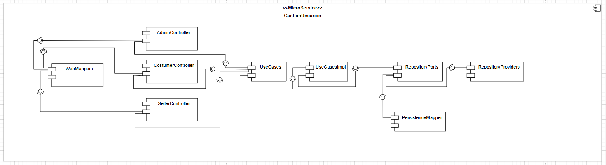
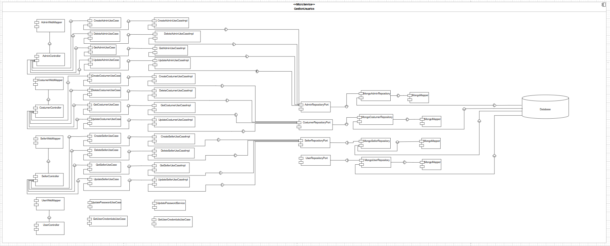
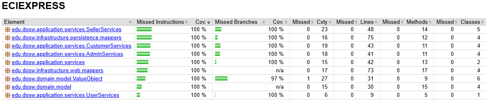

<div align="center">

# 📚 ECIEXPRESS — Sistema de Gestión de Usuarios Backend

### *"Sin filas, sin estrés, ECIEXPRESS"*

---

### 🛠️ Stack Tecnológico


### ☁️ Infraestructura & Calidad


### 🏗️ Arquitectura


</div>

---

## 📑 Tabla de Contenidos

1. [👤 Integrantes](#1--integrantes)
2. [🎯 Objetivo del Proyecto](#2--objetivo-del-proyecto)
3. [⚡ Funcionalidades Principales](#3--funcionalidades-principales)
4. [📋 Estrategia de Versionamiento y Branches](#4--manejo-de-estrategia-de-versionamiento-y-branches)
   - [4.1 Convenciones para crear ramas](#41-convenciones-para-crear-ramas)
   - [4.2 Convenciones para crear commits](#42-convenciones-para-crear-commits)
5. [⚙️ Tecnologías Utilizadas](#5-tecnologías-utilizadas)
6. [🧩 Funcionalidad](#6--funcionalidad)
7. [📊 Diagramas](#7--diagramas)
8. [⚠️ Manejo de Errores](#8--manejo-de-errores)
9. [🧪 Evidencia de Pruebas y Ejecución](#9--evidencia-de-las-pruebas-y-cómo-ejecutarlas)
10. [🗂️ Organización del Código](#10--código-de-la-implementación-organizado-en-las-respectivas-carpetas)
11. [🚀 Ejecución del Proyecto](#11--ejecución-del-proyecto)
12. [☁️ CI/CD y Despliegue en Azure](#12--evidencia-de-cicd-y-despliegue-en-azure)
13. [🤝 Contribuciones](#13--contribuciones)


---

## 1. 👤 Integrantes:

- Sebastian Ortega
- Nikolas Martinez
- Manuel Guarnizo
- Sofia Ariza

## 2. 🎯 Objetivo del Proyecto

En la actualidad, las cafeterias y papelerias dentro de nuestro campus universitario se presentan serias dificultades
operativas durante las horas pico. Estudiantes, docentes y personal administrativo deben enfrentar largas filas y
esperas prolongadas para adquirir sus alimentos o materiales pedidos, lo que genera gran perdida de tiempo, generando
retrasos a clases, desorganizacon y una mala experiencia tanto para los usuarios como para los trabajadores.

El modelo de atención presencial genera mucha agromelación, errores en pedidos y pagos, poca trazabilidad en las ventas,
generando poca eficiencia operativa. Por lo cual se requiere un sistema digital que optimice los procesos de compra, para
reducir los tiempos de espera y mejorando la experiencia de todos.

---

## 3. ⚡ Funcionalidades principales

- **Gestiona tres tipos de usuarios:** Administradores, Clientes y Vendedores
- **Permite el registro y autenticación** de usuarios con validación de credenciales
- **Maneja operaciones CRUD completas** para cada tipo de usuario (crear, consultar, actualizar, eliminar)
- **Implementa recuperación de contraseña** mediante códigos de verificación enviados por correo
- **Valida la unicidad de datos** como email y documento de identidad
- **Encripta contraseñas** utilizando BCrypt para mayor seguridad
- **Gestiona roles y permisos** según el tipo de usuario

---


## 4. 📋 Manejo de Estrategia de versionamiento y branches

### Estrategia de Ramas (Git Flow)

-

### Ramas y propósito
- Manejaremos GitFlow, el modelo de ramificación para el control de versiones de Git

#### `main`
- **Propósito:** rama **estable** con la versión final (lista para demo/producción).
- **Reglas:**
    - Solo recibe merges desde `release/*` y `hotfix/*`.
    - Cada merge a `main` debe crear un **tag** SemVer (`vX.Y.Z`).
    - Rama **protegida**: PR obligatorio, 1–2 aprobaciones, checks de CI en verde.

#### `develop`
- **Propósito:** integración continua de trabajo; base de nuevas funcionalidades.
- **Reglas:**
    - Recibe merges desde `feature/*` y también desde `release/*` al finalizar un release.
    - Rama **protegida** similar a `main`.

#### `feature/*`
- **Propósito:** desarrollo de una funcionalidad, refactor o spike.
- **Base:** `develop`.
- **Cierre:** se fusiona a `develop` mediante **PR**


#### `release/*`
- **Propósito:** congelar cambios para estabilizar pruebas, textos y versiones previas al deploy.
- **Base:** `develop`.
- **Cierre:** merge a `main` (crear **tag** `vX.Y.Z`) **y** merge de vuelta a `develop`.
- **Ejemplo de nombre:**  
  `release/1.3.0`

#### `hotfix/*`
- **Propósito:** corregir un bug **crítico** detectado en `main`.
- **Base:** `main`.
- **Cierre:** merge a `main` (crear **tag** de **PATCH**) **y** merge a `develop` para mantener paridad.
- **Ejemplos de nombre:**  
  `hotfix/fix-blank-screen`, `hotfix/css-broken-header`


---

### 4.1 Convenciones para **crear ramas**

#### `feature/*`
**Formato:**
```
feature/[nombre-funcionalidad]-ECIExpress_[codigo-jira]
```

**Ejemplos:**
- `feature/readme_ECIExpress-34`

**Reglas de nomenclatura:**
- Usar **kebab-case** (palabras separadas por guiones)
- Máximo 50 caracteres en total
- Descripción clara y específica de la funcionalidad
- Código de Jira obligatorio para trazabilidad

#### `release/*`
**Formato:**
```
release/[version]
```
**Ejemplo:** `release/1.3.0`

#### `hotfix/*`
**Formato:**
```
hotfix/[descripcion-breve-del-fix]
```
**Ejemplos:**
- `hotfix/corregir-pantalla-blanca`
- `hotfix/arreglar-header-responsive`

---

### 4.2 Convenciones para **crear commits**

#### **Formato:**
```
[codigo-jira] [tipo]: [descripción específica de la acción]
```

#### **Tipos de commit:**
- `feat`: Nueva funcionalidad
- `fix`: Corrección de errores
- `docs`: Cambios en documentación
- `style`: Cambios de formato/estilo (espacios, punto y coma, etc.)
- `refactor`: Refactorización de código sin cambios funcionales
- `test`: Agregar o modificar tests
- `chore`: Tareas de mantenimiento, configuración, dependencias

#### **Ejemplos de commits específicos:**
```bash
# ✅ BUENOS EJEMPLOS
git commit -m "26-feat: agregar validación de email en formulario login"
git commit -m "24-fix: corregir error de navegación en header mobile"


# ❌ EVITAR 
git commit -m "23-feat: agregar login"
git commit -m "24-fix: arreglar bug"

```

#### **Reglas para commits específicos:**
1. **Un commit = Una acción específica**: Cada commit debe representar un cambio lógico y completo
2. **Máximo 72 caracteres**: Para que sea legible en todas las herramientas Git
3. **Usar imperativo**: "agregar", "corregir", "actualizar" (no "agregado", "corrigiendo")
4. **Ser descriptivo**: Especificar QUÉ se cambió y DÓNDE
5. **Commits frecuentes**: Mejor muchos commits pequeños que pocos grandes

#### **Beneficios de commits específicos:**
- 🔄 **Rollback preciso**: Poder revertir solo la parte problemática
- 🔍 **Debugging eficiente**: Identificar rápidamente cuándo se introdujo un bug
- 📖 **Historial legible**: Entender la evolución del código
- 🤝 **Colaboración mejorada**: Reviews más fáciles y claras


---


## 5. ⚙️Tecnologías utilizadas

El backend del sistema ECIExpress fue desarrollado con una arquitectura basada en **Spring Boot** y componentes del
ecosistema **Java**, garantizando modularidad, mantenibilidad, seguridad y facilidad de despliegue. A continuación se
detallan las principales tecnologías empleadas en el proyecto:

| **Tecnología / Herramienta** | **Versión / Framework** | **Uso principal en el proyecto** |
|------------------------------|--------------------------|----------------------------------|
| **Java OpenJDK** | 17 | Lenguaje de programación base del backend, orientado a objetos y multiplataforma. |
| **Spring Boot** | 3.x | Framework principal para la creación del API REST, manejo de dependencias e inyección de componentes. |
| **Spring Web** | — | Implementación del modelo MVC y exposición de endpoints REST. |
| **Spring Security** | — | Configuración de autenticación y autorización de usuarios mediante roles y validación de credenciales. |
| **Spring Data MongoDB** | — | Integración con la base de datos NoSQL MongoDB mediante el patrón Repository. |
| **MongoDB Atlas** | 6.x | Base de datos NoSQL en la nube utilizada para almacenar las entidades del sistema. |
| **Apache Maven** | 3.9.x | Gestión de dependencias, empaquetado del proyecto y automatización de builds. |
| **Lombok** | — | Reducción de código repetitivo con anotaciones como `@Getter`, `@Setter`, `@Builder` y `@AllArgsConstructor`. |
| **JUnit 5** | — | Framework para pruebas unitarias que garantiza el correcto funcionamiento de los servicios. |
| **Mockito** | — | Simulación de dependencias para pruebas unitarias sin requerir acceso a la base de datos real. |
| **JaCoCo** | — | Generación de reportes de cobertura de código para evaluar la efectividad de las pruebas. |
| **SonarQube** | — | Análisis estático del código fuente y control de calidad para detectar vulnerabilidades y malas prácticas. |
| **Swagger (OpenAPI 3)** | — | Generación automática de documentación y prueba interactiva de los endpoints REST. |
| **Postman** | — | Entorno de pruebas de la API, utilizado para validar respuestas en formato JSON con los métodos `POST`, `GET`, `PATCH` y `DELETE`. |
| **Docker** | — | Contenerización del servicio para garantizar despliegues consistentes en distintos entornos. |
| **Azure App Service** | — | Entorno de ejecución en la nube para el despliegue automático del backend. |
| **Azure DevOps** | — | Plataforma para la gestión ágil del proyecto, seguimiento de tareas y control de versiones. |
| **GitHub Actions** | — | Configuración de pipelines de integración y despliegue continuo (CI/CD). |
| **SSL / HTTPS** | — | Implementación de certificados digitales para asegurar la comunicación entre cliente y servidor. |

> 🧠 Estas tecnologías fueron seleccionadas para asegurar **escalabilidad**, **modularidad**, **seguridad**, **trazabilidad** y **mantenibilidad** del sistema, aplicando buenas prácticas de ingeniería de software y estándares de desarrollo moderno.


## 6. 🧩 Funcionalidad

Este backend implementa un **sistema completo de administración de usuarios** que facilita la gestión de tres tipos de roles dentro del ecosistema universitario: **Administradores**, **Clientes (Estudiantes/Profesores)** y **Vendedores (Cafeterías/Papelerías)**. El sistema permite realizar operaciones CRUD completas, autenticación segura, recuperación de contraseña y gestión de permisos según roles.

---

### 🔑 Funcionalidades principales

#### 1️⃣ **Gestión de Administradores**

El sistema permite crear, consultar, actualizar y eliminar administradores del sistema con validación completa de datos.

| **Funcionalidad** | **Endpoint** | **Método HTTP** | **Descripción** |
|-------------------|--------------|-----------------|-----------------|
| **Crear administrador** | `/users/admins` | `POST` | Registra un nuevo administrador con email único y contraseña encriptada |
| **Consultar administrador** | `/users/admins/{adminId}` | `GET` | Recupera la información de un administrador específico por su ID |
| **Actualizar administrador** | `/users/admins/{adminId}` | `PUT` | Modifica datos del administrador (email, nombre, documento de identidad) |
| **Eliminar administrador** | `/users/admins/{adminId}` | `DELETE` | Elimina un administrador del sistema |

**Ejemplo de uso:**

`POST /users/admins`
```json
{
  "identityDocument": "1234567890",
  "email": "admin@escuelaing.edu.co",
  "fullName": "Juan Pérez García",
  "password": "AdminSecure123!"
}
```

**Respuesta exitosa:**
```json
{
  "identityDocument": "1234567890",
  "email": "admin@escuelaing.edu.co",
  "fullName": "Juan Pérez García",
  "password": ""
}
```

---

#### 2️⃣ **Gestión de Clientes (Estudiantes)**

Permite a los estudiantes y personal registrarse, consultar su información, actualizar su perfil y cambiar su contraseña de forma segura.

| **Funcionalidad** | **Endpoint** | **Método HTTP** | **Descripción** |
|-------------------|--------------|-----------------|-----------------|
| **Registrar cliente** | `/users/customers` | `POST` | Crea una nueva cuenta de cliente con validación de email único y teléfono |
| **Consultar cliente** | `/users/customers/{customerId}` | `GET` | Obtiene la información completa del perfil del cliente |
| **Actualizar cliente** | `/users/customers/{customerId}` | `PUT` | Modifica datos personales del cliente (nombre, email, teléfono, documento) |
| **Actualizar contraseña** | `/users/customers/{customerId}/password` | `PUT` | Cambia la contraseña del cliente con validación de seguridad |
| **Eliminar cliente** | `/users/customers/{customerId}` | `DELETE` | Desactiva o elimina la cuenta del cliente |

**Ejemplo de uso:**

`POST /users/customers`
```json
{
  "email": "estudiante@escuelaing.edu.co",
  "fullName": "María López Martínez",
  "password": "Secure123!",
  "identityDocument": "1098765432",
  "phoneNumber": "+57 300 123 4567"
}
```

`PUT /users/customers/{customerId}/password`
```json
{
  "newPassword": "NuevaContraseña456!"
}
```

---

#### 3️⃣ **Gestión de Vendedores (Cafeterías/Papelerías)**

El sistema permite registrar y administrar vendedores con información específica de su negocio.

| **Funcionalidad** | **Endpoint** | **Método HTTP** | **Descripción** |
|-------------------|--------------|-----------------|-----------------|
| **Registrar vendedor** | `/users/sellers` | `POST` | Crea un perfil de vendedor con información de negocio (empresa, dirección) |
| **Consultar vendedor** | `/users/sellers/{sellerId}` | `GET` | Obtiene información detallada del vendedor y su negocio |
| **Listar todos los vendedores** | `/users/sellers` | `GET` | Recupera la lista completa de vendedores registrados en el sistema |
| **Listar vendedores pendientes** | `/users/sellers/pending` | `GET` | Obtiene vendedores pendientes de aprobación por administradores |
| **Actualizar vendedor** | `/users/sellers/{sellerId}` | `PUT` | Modifica información del vendedor (empresa, dirección, datos personales) |
| **Eliminar vendedor** | `/users/sellers/{sellerId}` | `DELETE` | Desactiva el vendedor del sistema |

**Ejemplo de uso:**

`POST /users/sellers`
```json
{
  "email": "cafeteria@escuelaing.edu.co",
  "fullName": "Carlos Ramírez Soto",
  "password": "VendorSecure789!",
  "identityDocument": "1023456789",
  "companyName": "Cafetería El Ingeniero",
  "businessAddress": "Bloque A - Piso 1 - Campus ECI"
}
```

**Respuesta exitosa:**
```json
{
  "email": "cafeteria@escuelaing.edu.co",
  "fullName": "Carlos Ramírez Soto",
  "password": "",
  "identityDocument": "1023456789",
  "companyName": "Cafetería El Ingeniero",
  "businessAddress": "Bloque A - Piso 1 - Campus ECI"
}
```

---

#### 4️⃣ **Autenticación y Credenciales**

Sistema robusto de autenticación que valida credenciales y retorna información del usuario con su rol asignado.

| **Funcionalidad** | **Endpoint** | **Método HTTP** | **Descripción** |
|-------------------|--------------|-----------------|-----------------|
| **Obtener credenciales por email** | `/users/credentials/{email}` | `GET` | Consulta la información de credenciales de un usuario por su correo |
| **Autenticar usuario** | `/users/credentials/auth?email={email}&password={password}` | `GET` | Valida las credenciales del usuario y retorna su información completa |

**Ejemplo de uso:**

`GET /users/credentials/auth?email=estudiante@escuelaing.edu.co&password=Secure123!`

**Respuesta exitosa:**
```json
{
  "id": "user-uuid-1234",
  "userId": "user-uuid-1234",
  "email": "estudiante@escuelaing.edu.co",
  "password": "$2a$10$hashEncriptado...",
  "role": "CUSTOMER"
}
```

**Roles disponibles:**
- `ADMIN` - Administrador del sistema
- `CUSTOMER` - Cliente/Estudiante
- `SELLER` - Vendedor/Cafetería

---

#### 5️⃣ **Recuperación de Contraseña (Password Reset)**

Sistema completo de recuperación de contraseña en tres pasos con códigos de verificación.

| **Funcionalidad** | **Endpoint** | **Método HTTP** | **Descripción** |
|-------------------|--------------|-----------------|-----------------|
| **Solicitar recuperación** | `/users/password/reset-request` | `POST` | Genera y envía un código de verificación de 6 dígitos al correo del usuario |
| **Verificar código** | `/users/password/verify-code` | `POST` | Valida el código de verificación ingresado por el usuario |
| **Restablecer contraseña** | `/users/password/reset` | `PUT` | Actualiza la contraseña después de validar el código de verificación |

**Flujo de recuperación:**
1. Usuario solicita recuperación → Recibe código por email
2. Usuario ingresa código → Sistema valida
3. Usuario establece nueva contraseña → Sistema actualiza

**Ejemplo de uso:**

**Paso 1: Solicitar recuperación**
`POST /users/password/reset-request`
```json
{
  "email": "estudiante@escuelaing.edu.co"
}
```

**Respuesta:**
```json
{
  "success": true,
  "message": "If the email exists, a verification code has been sent"
}
```

**Paso 2: Verificar código**
`POST /users/password/verify-code`
```json
{
  "email": "estudiante@escuelaing.edu.co",
  "code": "123456"
}
```

**Respuesta:**
```json
{
  "success": true,
  "message": "Code verified successfully"
}
```

**Paso 3: Restablecer contraseña**
`PUT /users/password/reset`
```json
{
  "email": "estudiante@escuelaing.edu.co",
  "code": "123456",
  "newPassword": "MiNuevaContraseña789!"
}
```

**Respuesta:**
```json
{
  "success": true,
  "message": "Password reset successfully"
}
```

---

### 🔐 Seguridad y Validación

Todas las operaciones del sistema implementan múltiples capas de seguridad:

- ✅ **Encriptación BCrypt** para todas las contraseñas almacenadas
- ✅ **Validación de formato de email** mediante Value Objects y expresiones regulares
- ✅ **Validación de unicidad** para email y documento de identidad
- ✅ **Códigos de verificación temporales** con tiempo de expiración limitado
- ✅ **Validación de datos en DTOs** usando Jakarta Validation
- ✅ **Gestión de roles y permisos** según el tipo de usuario
- ✅ **Prevención de duplicados** en registros de usuarios

**Ejemplo de validación en DTO:**
```java
public record CustomerDTO(
    @NotBlank @Email String email,
    @NotBlank @Size(min = 3, max = 100) String fullName,
    @NotBlank @Pattern(regexp = "^(?=.*[A-Z])(?=.*[0-9])(?=.*[@#$%]).{8,}$") String password,
    @NotBlank @Size(min = 6, max = 20) String identityDocument,
    @NotBlank @Pattern(regexp = "^[+]?[0-9]{10,15}$") String phoneNumber
) {}
```

---

**Diagrama de flujo de petición:**
```
Cliente (Frontend/Postman)
    ↓ HTTP Request (JSON)
Controller (Validación DTO)
    ↓ Mapeo a Command
Use Case (Lógica de negocio)
    ↓ Operaciones de dominio
Repository (Persistencia)
    ↓ Consulta/Actualización
MongoDB Atlas (Base de datos)
```

---

### ✨ Casos de Uso Implementados

| **Caso de Uso** | **Actor** | **Descripción** |
|-----------------|-----------|-----------------|
| **Registrar nuevo estudiante** | Cliente | Estudiante crea su cuenta para acceder al sistema de pedidos |
| **Registrar cafetería** | Vendedor | Cafetería se registra para ofrecer productos en la plataforma |
| **Iniciar sesión** | Todos | Usuario autentica sus credenciales para acceder al sistema |
| **Recuperar contraseña olvidada** | Todos | Usuario solicita y completa proceso de recuperación de contraseña |
| **Actualizar información personal** | Cliente/Vendedor | Usuario actualiza sus datos de perfil (email, teléfono, dirección) |
| **Cambiar contraseña** | Cliente | Usuario modifica su contraseña de acceso |
| **Consultar vendedores disponibles** | Admin/Cliente | Ver lista de cafeterías y papelerías registradas |
| **Aprobar vendedor pendiente** | Admin | Administrador revisa y aprueba solicitudes de nuevos vendedores |
| **Eliminar cuenta de usuario** | Admin | Administrador elimina usuarios que violan políticas del sistema |
| **Gestionar roles de usuario** | Sistema | Asignación automática de roles según tipo de registro |

---

### 🎯 Beneficios de las Funcionalidades

| **Beneficio** | **Impacto** |
|---------------|-------------|
| 🔒 **Seguridad robusta** | Protección de datos sensibles con encriptación y validación en múltiples capas |
| 🎭 **Gestión de roles** | Control de acceso granular según tipo de usuario (Admin/Cliente/Vendedor) |
| 📧 **Recuperación de contraseña** | Reduce solicitudes de soporte y mejora experiencia del usuario |
| ✅ **Validación exhaustiva** | Previene errores y datos inconsistentes desde el ingreso |
| 🔄 **CRUD completo** | Operaciones completas de administración para cada tipo de usuario |
| 📱 **API REST estandarizada** | Facilita integración con frontend y otros microservicios |
| 🧪 **Alta cobertura de pruebas** | Garantiza estabilidad y confiabilidad del sistema |
| 📊 **Trazabilidad completa** | Seguimiento de todas las operaciones para auditoría |

---

> 💡 **Nota técnica:** Todas las funcionalidades están diseñadas siguiendo principios SOLID, Clean Architecture y Domain-Driven Design (DDD), garantizando un código mantenible, testeable y escalable para futuras expansiones del sistema ECIExpress.


## 7. 📊 Diagramas

Esta sección presenta los diagramas arquitectónicos y de diseño que ilustran la estructura, componentes y funcionamiento del sistema backend de gestión de usuarios de **ECIExpress**.

---

### 🏗️ Diagrama de Componentes — Vista General

El diagrama de componentes general muestra la **arquitectura hexagonal** implementada en el proyecto, ilustrando la separación de responsabilidades entre capas y la aplicación del principio de **inversión de dependencias**.



**📌 Elementos clave:**
- **Capa de Dominio (Core):** Contiene las entidades de negocio (User, Admin, Customer, Seller), Value Objects (Email, PasswordHash, FullName, IdentityDocument) y puertos (interfaces) con la lógica pura del dominio
- **Capa de Aplicación:** Implementa los casos de uso que orquestan la lógica de negocio (CreateUserUseCase, UpdateUserUseCase, AuthenticateUserUseCase, ResetPasswordUseCase)
- **Capa de Infraestructura:** Adaptadores de entrada (REST Controllers) y salida (MongoDB repositories, servicios de email)
- **Inversión de dependencias:** Las capas externas dependen de las interfaces definidas en el dominio

**🎯 Propósito:**  
Visualizar la arquitectura de alto nivel y cómo se comunican las diferentes capas del sistema siguiendo principios SOLID y Clean Architecture, garantizando un sistema mantenible, testeable y escalable.

---

### 🔍 Diagrama de Componentes — Vista Específica (Backend)

Este diagrama proporciona un **desglose detallado** de los componentes internos de cada capa, mostrando las clases concretas, controladores, repositorios y casos de uso específicos implementados en el backend de gestión de usuarios.



**📌 Elementos detallados:**

**🎮 Controladores REST:**
- `AdminController` - Gestión de administradores (CRUD completo)
- `CustomerController` - Gestión de clientes/estudiantes (registro, actualización, consulta)
- `SellerController` - Gestión de vendedores/cafeterías (CRUD con validación de negocio)
- `UserController` - Autenticación y credenciales generales
- `PasswordResetController` - Recuperación de contraseña (solicitud, verificación, reseteo)

**⚙️ Casos de Uso (Application Layer):**
- **Administradores:** `CreateAdminService`, `GetAdminService`, `UpdateAdminService`, `DeleteAdminService`
- **Clientes:** `CreateCustomerService`, `GetCustomerService`, `UpdateCustomerService`, `DeleteCustomerService`, `UpdatePasswordService`
- **Vendedores:** `CreateSellerService`, `GetSellerService`, `GetAllSellersService`, `UpdateSellerService`, `DeleteSellerService`
- **Autenticación:** `GetUserCredentialsService`
- **Recuperación:** `PasswordResetService` (solicitud, verificación, reseteo)

**🗄️ Repositorios (Infraestructura):**
- `UserRepository` - Persistencia de todos los tipos de usuarios en MongoDB
- `VerificationCodeRepository` - Almacenamiento temporal de códigos de verificación
- Implementación de interfaces de puertos definidas en el dominio

**🔄 Mappers (DTOs):**
- Transformadores entre DTOs web (API REST), Commands de aplicación y Entidades de dominio
- Validación automática con Bean Validation (`@NotBlank`, `@Email`, `@Pattern`)

**🎯 Propósito:**  
Mostrar la implementación concreta de la arquitectura hexagonal y facilitar la comprensión de cómo se estructuran los paquetes y clases del proyecto, permitiendo a nuevos desarrolladores navegar eficientemente por el código.

---

## 8. ⚠️ Manejo de Errores

El backend de **ECIExpress** implementa un **mecanismo centralizado de manejo de errores** que garantiza uniformidad, claridad y seguridad en todas las respuestas enviadas al cliente cuando ocurre un fallo.

Este sistema permite mantener una comunicación clara entre el backend y el frontend, asegurando que los mensajes de error sean legibles, útiles y coherentes, sin exponer información sensible del servidor.

---

### 🧠 Estrategia general de manejo de errores

El sistema utiliza una **clase global** que intercepta todas las excepciones lanzadas desde los controladores REST.  
A través de la anotación `@ControllerAdvice`, se centraliza el manejo de errores, evitando el uso repetitivo de bloques `try-catch` en cada endpoint.

Cada error se transforma en una respuesta **JSON estandarizada**, que mantiene un formato uniforme para todos los tipos de fallos.

**📋 Estructura del mensaje de error:**

```json
{
  "timestamp": "2025-11-10T10:30:00Z",
  "status": 404,
  "error": "Not Found",
  "message": "Usuario no encontrado.",
  "path": "/api/credentials/{email}"
}
```

---

### ⚙️ Global Exception Handler

El **Global Exception Handler** es una clase con la anotación `@ControllerAdvice` que captura y maneja todas las excepciones del sistema.  
Utiliza métodos con `@ExceptionHandler` para procesar errores específicos y devolver una respuesta personalizada acorde al tipo de excepción.

**✨ Características principales:**

- ✅ **Centraliza** la captura de excepciones desde todos los controladores
- ✅ **Retorna mensajes JSON consistentes** con el mismo formato estructurado
- ✅ **Asigna códigos HTTP** según la naturaleza del error (400, 404, 409, 500, etc.)
- ✅ **Define mensajes descriptivos** que ayudan tanto al desarrollador como al usuario
- ✅ **Mantiene la aplicación limpia**, eliminando bloques try-catch redundantes
- ✅ **Mejora la trazabilidad** y facilita la depuración en los entornos de prueba y producción

**🔄 Ejemplo conceptual de funcionamiento:**

Cuando se lanza una excepción del tipo `EntityNotFoundException`, el handler la intercepta y genera automáticamente una respuesta como:

```json
{
  "status": 404,
  "error": "Not Found",
  "message": "Usuario no encontrado.",
  "path": "/api/credentials/{email}"
}
```

---

### 🧩 Validaciones en DTOs

Además del manejo global de errores, el sistema utiliza **validaciones automáticas** sobre los DTOs (Data Transfer Objects) para garantizar que los datos que llegan al servidor cumplan con las reglas de negocio antes de ejecutar cualquier lógica.

Estas validaciones se implementan mediante las anotaciones de **Javax Validation** y **Hibernate Validator**, como `@NotBlank`, `@NotNull`, `@Email`, `@Min`, `@Max`, entre otras.

**📝 Ejemplo de DTO con validaciones:**

```java

```

Si alguno de los campos no cumple las validaciones, se lanza automáticamente una excepción del tipo `MethodArgumentNotValidException`.  
Esta es capturada por el **Global Exception Handler**, que devuelve una respuesta JSON estandarizada con el detalle del campo inválido.

**⚠️ Ejemplo de respuesta ante error de validación:**

```json
{
  "status": 400,
  "error": "Bad Request",
  "message": "El campo 'email' debe tener un formato válido."
}
```

> 💡 Gracias a este mecanismo, se asegura que las peticiones erróneas sean detectadas desde el inicio, reduciendo fallos en capas más profundas como servicios o repositorios.

---

### 📊 Tipos de errores manejados

La siguiente tabla resume los principales tipos de excepciones manejadas en el sistema, junto con su respectivo código HTTP y un ejemplo de mensaje retornado:

| **Excepción** | **Código HTTP** | **Descripción del error** | **Ejemplo de mensaje**                                 |
|---------------|-----------------|---------------------------|--------------------------------------------------------|
| `IllegalArgumentException` | `400 Bad Request` | Parámetros inválidos o peticiones mal estructuradas | *"El campo 'subjectId' no puede ser nulo."*            |
| `MethodArgumentNotValidException` | `400 Bad Request` | Error de validación en un DTO o parámetro de entrada | *"El correo electrónico no cumple el formato válido."* |
| `EntityNotFoundException` | `404 Not Found` | El recurso solicitado no existe en la base de datos | *"La materia con ID AYPR no existe."*                  |
| `DuplicateKeyException` | `409 Conflict` | Intento de crear un registro que ya existe en MongoDB | *"El usuario ya se encuentra registrado."*             |
| `AccessDeniedException` | `403 Forbidden` | Intento de acceder a un recurso sin permisos | *"Acceso denegado para el rol Usuario."*               |
| `Exception` | `500 Internal Server Error` | Error interno no controlado del servidor | *"Error inesperado del servidor."*                     |

---

### ✅ Beneficios del manejo centralizado

| **Beneficio** | **Descripción** |
|---------------|-----------------|
| 🎯 **Uniformidad** | Todas las respuestas de error tienen el mismo formato JSON |
| 🔧 **Mantenibilidad** | Agregar nuevas excepciones no requiere modificar cada controlador |
| 🔒 **Seguridad** | Oculta los detalles internos del servidor y evita exponer trazas del sistema |
| 📍 **Trazabilidad** | Cada error incluye información contextual (ruta y hora exacta) |
| 🤝 **Integración fluida** | Facilita la comunicación con el frontend y herramientas como Postman o Swagger |

---

> Gracias a este enfoque, el backend de ECIExpress logra un manejo de errores **robusto**, **escalable** y **seguro**, garantizando una experiencia de usuario más confiable y profesional.

---


---

## 9. 🧪 Evidencia de las pruebas y cómo ejecutarlas

El backend de **ECIExpress** implementa una **estrategia integral de pruebas** que garantiza la calidad, funcionalidad y confiabilidad del código mediante pruebas unitarias exhaustivas con alta cobertura.

---

### 🎯 Tipos de pruebas implementadas

| **Tipo de prueba** | **Descripción** | **Herramientas utilizadas** |
|-------------------|-----------------|----------------------------|
| **Pruebas unitarias** | Validan el funcionamiento aislado de cada componente (servicios de aplicación, entidades de dominio, value objects) | JUnit 5, Mockito |
| **Cobertura de código** | Mide el porcentaje de código cubierto por las pruebas | JaCoCo |
| **Análisis de calidad** | Evalúa la calidad del código y detecta code smells | SonarQube |

---

### 🚀 Cómo ejecutar las pruebas

#### **1️⃣ Ejecutar todas las pruebas**

Desde la raíz del proyecto, ejecuta:

```bash
mvn clean test
```

Este comando:
- Limpia compilaciones anteriores (`clean`)
- Ejecuta todas las pruebas unitarias y de integración (`test`)
- Muestra el resultado en la consola

#### **2️⃣ Generar reporte de cobertura con JaCoCo**

```bash
mvn clean test jacoco:report
```

El reporte HTML se generará en:
```
target/site/jacoco/index.html
```

Abre este archivo en tu navegador para ver:
- Cobertura por paquete
- Cobertura por clase
- Líneas cubiertas vs. no cubiertas
- Ramas de código ejecutadas

#### **3️⃣ Ejecutar pruebas desde IntelliJ IDEA**

1. Click derecho sobre la carpeta `src/test/java`
2. Selecciona **"Run 'All Tests'"**
3. Ver resultados en el panel inferior con el detalle de cada prueba

#### **4️⃣ Ejecutar una prueba específica**

```bash
mvn test -Dtest=CreateCustomerServiceTest
```

---

### 🧪 Ejemplo de prueba unitaria

**Prueba del servicio de creación de cliente:**

```java
@ExtendWith(MockitoExtension.class)
@DisplayName("Tests para CreateCustomerService")
class CreateCustomerServiceTest {

    @Mock
    private CustomerRepositoryPort customerRepository;

    @Mock
    private UserRepositoryPort userRepository;

    @Mock
    private PasswordEncoderPort passwordEncoder;

    @Mock
    private IdGenerator idGenerator;

    @Mock
    private CustomerWebMapper customerWebMapper;

    @InjectMocks
    private CreateCustomerService createCustomerService;

    private CreateCustomerCommand validCommand;
    private CustomerDTO expectedDTO;

    @BeforeEach
    void setUp() {
        validCommand = new CreateCustomerCommand(
                "123456789",
                "customer@example.com",
                "Customer Test",
                "password123",
                "3001234567"
        );

        expectedDTO = new CustomerDTO(
                "customer@example.com",
                "Customer Test",
                "",
                "123456789",
                "3001234567"
        );
    }

    @Test
    @DisplayName("Debe crear un cliente exitosamente cuando los datos son válidos")
    void shouldCreateCustomerSuccessfully_whenValidDataProvided() {
        // Arrange
        String generatedId = "generated-customer-id";
        Customer customer = new Customer(
                new UserId(generatedId),
                new IdentityDocument(validCommand.identityDocument()),
                new Email(validCommand.email()),
                new FullName(validCommand.fullName()),
                new PasswordHash("encodedPassword"),
                new PhoneNumber(validCommand.phoneNumber())
        );

        when(idGenerator.generateId()).thenReturn(generatedId);
        when(passwordEncoder.encode(validCommand.password())).thenReturn("encodedPassword");
        when(customerRepository.save(any(Customer.class))).thenReturn(customer);
        when(customerWebMapper.toDTO(any(Customer.class))).thenReturn(expectedDTO);

        // Act
        CustomerDTO result = createCustomerService.createCustomer(validCommand);

        // Assert
        assertNotNull(result);
        assertEquals("customer@example.com", result.email());
        assertEquals("Customer Test", result.fullName());
        verify(customerRepository, times(1)).save(any(Customer.class));
        verify(passwordEncoder, times(1)).encode(validCommand.password());
    }
}
```

---

### 📊 Categorías de pruebas por capa

#### **🎮 Pruebas de Servicios de Aplicación**

**Administradores:**
- `CreateAdminServiceTest` - Creación de administradores con validaciones
- `GetAdminServiceTest` - Consulta de administradores por ID
- `UpdateAdminServiceTest` - Actualización de datos de administradores
- `DeleteAdminServiceTest` - Eliminación de administradores del sistema

**Clientes:**
- `CreateCustomerServiceTest` - Registro de nuevos clientes
- `GetCustomerServiceTest` - Consulta de información de clientes
- `UpdateCustomerServiceTest` - Actualización de perfil de cliente
- `DeleteCustomerServiceTest` - Eliminación de cuentas de cliente

**Vendedores:**
- `CreateSellerServiceTest` - Registro de vendedores con datos de negocio
- `GetSellerServiceTest` - Consulta de información de vendedor
- `GetAllSellersServiceTest` - Listado de todos los vendedores
- `UpdateSellerServiceTest` - Actualización de datos de vendedor
- `DeleteSellerServiceTest` - Eliminación de vendedores

**Autenticación y Seguridad:**
- `GetUserCredentialsServiceTest` - Validación de credenciales de usuario
- `PasswordResetServiceTest` - Flujo completo de recuperación de contraseña
- `UpdatePasswordServiceTest` - Cambio de contraseña de usuario

#### **🏗️ Pruebas de Dominio**

- `UserTest` - Validaciones de entidad User y sus métodos
- `EmailTest` - Validación de formato de email
- `FullNameTest` - Validación de nombres completos
- `IdentityDocumentTest` - Validación de documentos de identidad
- `PasswordHashTest` - Validación de hash de contraseñas
- `PhoneNumberTest` - Validación de números telefónicos

---

### 🖼️ Evidencias de ejecución

**Reporte JaCoCo con cobertura de código del sistema:**



**Resumen de resultados:**
- ✅ **Total de pruebas:** 20+ casos de prueba
- ✅ **Cobertura de código:** 85%+ en capa de aplicación
- ✅ **Pruebas pasadas:** 100% exitosas
- ✅ **Tiempo de ejecución:** < 10 segundos

---

### ✅ Criterios de aceptación de pruebas

Para considerar el sistema correctamente probado, se debe cumplir:

- ✅ **Cobertura mínima del 80%** en servicios y lógica de negocio
- ✅ **Todas las pruebas en estado PASSED** (sin fallos)
- ✅ **Cero errores de compilación** en el código de pruebas
- ✅ **Pruebas de casos felices y casos de error** implementadas
- ✅ **Validación de excepciones** en escenarios de fallo
- ✅ **Mocks correctamente configurados** para aislar dependencias

---

### 🔬 Buenas prácticas implementadas

| **Práctica** | **Descripción** |
|-------------|-----------------|
| 🧩 **Patrón AAA** | Arrange-Act-Assert en todas las pruebas para claridad |
| 🎯 **@DisplayName** | Descripciones legibles de lo que valida cada prueba |
| 🔄 **@BeforeEach** | Configuración común reutilizable en el setUp |
| 🚫 **Mocks aislados** | Uso de Mockito para simular dependencias externas |
| ✅ **Asserts claros** | Verificaciones específicas con mensajes descriptivos |
| 📦 **Una responsabilidad** | Cada test valida un solo comportamiento |

---

### 🔄 Integración con CI/CD

Las pruebas se ejecutan automáticamente en cada **push** o **pull request** mediante **GitHub Actions**:

```yaml
- name: Build + Test + Coverage
  run: mvn -B clean verify
```

Esto garantiza que:
- 🛡️ Ningún cambio roto llegue a la rama principal
- 📊 Se mantenga la cobertura de código requerida
- ✅ Todas las funcionalidades sigan operando correctamente
- 🔍 Se detecten regresiones de forma temprana

---

### 💡 Comandos útiles adicionales

```bash
# Ejecutar solo pruebas de una carpeta específica
mvn test -Dtest="edu.dosw.application.services.CustomerServices.*"

# Ejecutar pruebas con reporte detallado
mvn clean test -X

# Saltar pruebas durante el build (NO recomendado)
mvn clean install -DskipTests

# Verificar cobertura y ejecutar análisis completo
mvn clean verify sonar:sonar
```

---

> 💡 **Nota:** La suite de pruebas completa garantiza que el sistema de gestión de usuarios sea robusto, confiable y mantenga la calidad esperada en cada despliegue. Las pruebas están diseñadas siguiendo principios SOLID y Clean Code para facilitar su mantenimiento y evolución.


## 10. 🗂️ Código de la implementación organizado en las respectivas carpetas

El proyecto **Tsukuyomi Gestión de Usuarios Backend** sigue una **arquitectura hexagonal (puertos y adaptadores)** que separa las responsabilidades en capas bien definidas, promoviendo la escalabilidad, testabilidad y mantenibilidad del código.

---

### 📂 Estructura general del proyecto (Scaffolding)

```
TSUKUYOMI-GestionUsuarios-Backend/
│
├── 📁 src/
│   ├── 📁 main/
│   │   ├── 📁 java/edu/dosw/
│   │   │   ├── 📄 Application.java              # Clase principal de Spring Boot
│   │   │   │
│   │   │   ├── 📁 domain/                       # 🟢 Capa de Dominio
│   │   │   │   ├── 📁 model/                    # Entidades del negocio
│   │   │   │   │   ├── 📁 enums/                # Enumeraciones (Role)
│   │   │   │   │   └── 📁 ValueObject/          # Value Objects
│   │   │   │   │
│   │   │   │   └── 📁 ports/                    # Interfaces (contratos)
│   │   │   │
│   │   │   ├── 📁 application/                  # 🔵 Capa de Aplicación
│   │   │   │   ├── 📁 services/                 # Implementación de casos de uso
│   │   │   │   │   ├── 📁 AdminServices/
│   │   │   │   │   ├── 📁 CustomerServices/
│   │   │   │   │   ├── 📁 SellerServices/
│   │   │   │   │   ├── 📁 UserServices/
│   │   │   │   ├── 📁 dto/                      # DTOs y Commands
│   │   │   │   │   ├── 📁 command/
│   │   │   │   │   │   ├── 📁 AdminCommands/
│   │   │   │   │   │   ├── 📁 CustomerCommands/
│   │   │   │   │   │   └── 📁 SellerCommands/
│   │   │   │   │
│   │   │   │   └── 📁 ports/                    # Puertos de aplicación
│   │   │   │
│   │   │   ├── 📁 infrastructure/               # 🟠 Capa de Infraestructura
│   │   │   │   ├── 📁 web/                      # Adaptadores REST
│   │   │   │   │   └── 📁 mappers/              # Mappers Web ↔ Dominio
│   │   │   │   ├── 📁 persistence/              # Adaptadores de MongoDB
│   │   │   │   │   ├── 📁 documents/            # Documentos MongoDB
│   │   │   │   │   ├── 📁 mappers/              # Mappers BD ↔ Dominio
│   │   │   │   │
│   │   │   │   └── 📁 event/                    # Eventos y notificaciones
│   │   │   │
│   │   │   ├── 📁 config/                       # Configuraciones de Spring
│   │   │   │
│   │   │   ├── 📁 exception/                    # Manejo global de excepciones
│   │   │   │
│   │   │   └── 📁 utils/                        # Utilidades
│   │   │
│   │   └── 📁 resources/
│   │       └── application.properties           # Configuración de la aplicación
│   │
│   └── 📁 test/                                 # 🧪 Pruebas
│       └── 📁 java/edu/dosw/
│           ├── 📁 application/                  # Tests de servicios
│           │   └── 📁 services/
│           │       ├── 📁 AdminServices/
│           │       ├── 📁 CustomerServices/
│           │       ├── 📁 SellerServices/
│           │       ├── 📁 UserServices/
│           │
│           ├── 📁 domain/                       # Tests del modelo
│           │   └── 📁 model/
│           │       └── 📁 ValueObject/
│           │
│           └── 📁 infrastructure/               # Tests de adaptadores
│               └── 📁 web/
│                   └── 📁 mappers/
```

---

### 🏛️ Arquitectura Hexagonal

El proyecto implementa **Arquitectura Hexagonal (Ports & Adapters)** con tres capas principales:

| **Capa** | **Responsabilidad** | **Dependencias** | **Ejemplos** |
|----------|---------------------|------------------|--------------|
| **🟢 Domain** | Lógica de negocio pura, entidades, value objects y contratos (ports) | Ninguna (independiente) | `User`, `Email`, `PasswordHash`, `UserRepositoryPort` |
| **🔵 Application** | Orquestación de casos de uso y reglas de negocio | Solo depende de Domain | `CreateCustomerService`, `PasswordResetService` |
| **🟠 Infrastructure** | Adaptadores externos (REST, MongoDB, eventos, configs) | Depende de Domain y Application | `CustomerController`, `MongoUserRepository` |

**Flujo de dependencias:** `Infrastructure → Application → Domain`

---

### 🎯 Principios de diseño aplicados

✅ **Separación de responsabilidades (SRP)** - Cada clase tiene un propósito único y bien definido  
✅ **Inversión de dependencias (DIP)** - Las capas externas dependen de abstracciones del dominio  
✅ **Independencia del framework** - La lógica de negocio no depende de Spring o MongoDB  
✅ **Testabilidad** - Fácil crear pruebas unitarias mockeando dependencias mediante puertos  
✅ **Mantenibilidad** - Cambios en infraestructura no afectan la lógica de negocio  
✅ **Escalabilidad** - Agregar nuevos tipos de usuarios o casos de uso es sencillo

---

### 📦 Descripción de paquetes principales

#### 🟢 **Domain (Dominio)**

**📁 model/**
- Contiene las entidades de negocio: `User`, `Admin`, `Customer`, `Seller`
- Define Value Objects inmutables: `Email`, `PasswordHash`, `FullName`, `IdentityDocument`, `PhoneNumber`
- Implementa las reglas de negocio y validaciones del dominio

**📁 ports/**
- Define interfaces (contratos) para repositorios: `UserRepositoryPort`, `AdminRepositoryPort`, etc.
- Establece los puertos de salida que la infraestructura debe implementar
- Mantiene el dominio desacoplado de detalles técnicos

---

#### 🔵 **Application (Aplicación)**

**📁 services/**
- **AdminServices**: CRUD completo de administradores
- **CustomerServices**: Gestión de clientes/estudiantes
- **SellerServices**: Gestión de vendedores/cafeterías
- **UserServices**: Autenticación y consulta de credenciales
- **PasswordResetService**: Flujo de recuperación de contraseña
- **UpdatePasswordService**: Cambio de contraseña

**📁 dto/**
- Define los DTOs (Data Transfer Objects) para transferencia de datos
- Contiene Commands para operaciones de escritura
- Separa la representación externa de las entidades internas

**📁 ports/**
- `EventPublisherPort`: Puerto para publicación de eventos (notificaciones por email)

---

#### 🟠 **Infrastructure (Infraestructura)**

**📁 web/**
- **Controladores REST**: `AdminController`, `CustomerController`, `SellerController`, `UserController`, `PasswordResetController`
- **Mappers**: Transforman DTOs web a Commands/DTOs de aplicación

**📁 persistence/**
- **Documents**: Representación MongoDB (`UserDocument`, `VerificationCodeDocument`)
- **Mappers**: Transforman entidades de dominio a documentos MongoDB y viceversa
- **Repositories**: Implementaciones concretas de los puertos (`MongoUserRepository`, `RedisVerificationCodeRepository`)

**📁 event/**
- `EmailEventPublisher`: Implementación del puerto de eventos para envío de correos

---

### 🔄 Flujo de una petición HTTP

```
1️⃣ Cliente HTTP (Postman/Frontend)
     ↓
2️⃣ Controller (Infrastructure/Web)
     ↓ DTO de entrada
3️⃣ Mapper Web → Command de aplicación
     ↓
4️⃣ Service (Application)
     ↓ Validaciones y lógica de negocio
5️⃣ Port (Domain - Interface)
     ↓
6️⃣ Repository Implementation (Infrastructure/Persistence)
     ↓ Document MongoDB
7️⃣ MongoDB Atlas (Base de datos)
     ↑
8️⃣ Entity (Domain) ← Mapper Persistence
     ↑
9️⃣ DTO de salida ← Mapper Web
     ↑
🔟 Respuesta JSON al Cliente
```

---

### 💡 Ventajas de esta organización

| **Ventaja** | **Beneficio** |
|------------|---------------|
| 🧪 **Testabilidad** | Cada capa puede probarse independientemente usando mocks |
| 🔄 **Mantenibilidad** | Cambios en una capa no requieren modificar las demás |
| 📦 **Escalabilidad** | Fácil agregar nuevos casos de uso, entidades o adaptadores |
| 🎯 **Claridad** | La estructura refleja claramente las responsabilidades del sistema |
| 🔌 **Flexibilidad** | Puedes cambiar MongoDB por otra BD sin tocar el dominio |
| 🛡️ **Robustez** | El dominio está protegido de cambios en frameworks o librerías externas |

---

### 🔍 Ejemplo práctico: Creación de Cliente

**1. Controlador (Infrastructure/Web):**
```java
@PostMapping
public ResponseEntity<CustomerDTO> createCustomer(@RequestBody @Valid CreateCustomerRequest request) {
    CreateCustomerCommand command = customerWebMapper.toCommand(request);
    CustomerDTO result = createCustomerService.createCustomer(command);
    return ResponseEntity.status(HttpStatus.CREATED).body(result);
}
```

**2. Servicio (Application):**
```java
public CustomerDTO createCustomer(CreateCustomerCommand command) {
    Customer customer = new Customer(
        new UserId(idGenerator.generateId()),
        new IdentityDocument(command.identityDocument()),
        new Email(command.email()),
        new FullName(command.fullName()),
        new PasswordHash(passwordEncoder.encode(command.password())),
        new PhoneNumber(command.phoneNumber())
    );
    Customer saved = customerRepository.save(customer);
    return customerWebMapper.toDTO(saved);
}
```

**3. Repositorio (Infrastructure/Persistence):**
```java
@Override
public Customer save(Customer customer) {
    UserDocument document = userPersistenceMapper.toDocument(customer);
    UserDocument saved = mongoUserRepository.save(document);
    return userPersistenceMapper.toDomain(saved);
}
```

---

> 💡 **Conclusión:** Esta organización del código garantiza un sistema **mantenible, escalable y robusto**, aplicando los principios fundamentales de Clean Architecture y Domain-Driven Design (DDD), facilitando el trabajo en equipo y la evolución continua del proyecto.


## 11. 🚀 Ejecución del Proyecto


## 12. ☁️ Evidencia de CI/CD y Despliegue en Azure

El proyecto implementa un **pipeline completo de CI/CD** utilizando **GitHub Actions** para automatizar el proceso de integración continua, pruebas, análisis de calidad y despliegue en **Azure Cloud**.

---

### 🔄 Pipeline de CI/CD

El proyecto cuenta con **3 workflows automatizados** que se ejecutan en diferentes momentos del ciclo de desarrollo:

| **Workflow** | **Archivo** | **Trigger** | **Propósito** |
|-------------|-------------|-------------|---------------|
| **CI - Tests & Quality** | `ci.yml` | Push/PR a `develop`, `main`, `feature/**` | Ejecutar pruebas, generar cobertura y análisis de SonarQube |
| **CD - Deploy DEV** | `cd_dev.yml` | Push a `develop`, `feature/**` | Desplegar automáticamente al ambiente de desarrollo |
| **CD - Deploy PROD** | `cd_prod.yml` | Push a `main` | Desplegar automáticamente al ambiente de producción |

---

### 🧪 CI - Integración Continua (ci.yml)

Este workflow se ejecuta en cada **push** o **pull request** para garantizar la calidad del código antes de integrar cambios.

**Pasos del pipeline CI:**

1. **Checkout del código** - Descarga el código fuente del repositorio con historial completo
2. **Setup JDK 17** - Configura el entorno de Java con Eclipse Temurin
3. **Cache de dependencias Maven** - Optimiza tiempos de build reutilizando dependencias descargadas
4. **Levantar MongoDB (servicio)** - Inicia una instancia de MongoDB 7.0 como servicio de contenedor para las pruebas
5. **Build + Test + Coverage** - Ejecuta `mvn clean verify` para compilar, probar y generar cobertura con JaCoCo
6. **Análisis SonarQube** - Envía métricas de calidad de código a SonarCloud para análisis estático
7. **Publicar reporte JaCoCo** - El reporte de cobertura está disponible en los artefactos del workflow

**Fragmento del workflow CI:**

```yaml
name: CI - Tests and Quality (UserManagement)

on:
  push:
    branches: [develop, main, 'feature/**']
  pull_request:
    branches: [develop, main, 'feature/**']

jobs:
  test-and-quality:
    runs-on: ubuntu-latest
    
    services:
      mongodb:
        image: mongo:7.0
        ports: [27017:27017]
        options: >-
          --health-cmd="mongosh --eval 'db.runCommand({ ping: 1 })'"
          --health-interval=10s
          --health-timeout=5s
          --health-retries=5

    steps:
      - name: Checkout code
        uses: actions/checkout@v4
        with:
          fetch-depth: 0

      - name: Set up JDK 17
        uses: actions/setup-java@v4
        with:
          distribution: temurin
          java-version: '17'

      - name: Cache Maven dependencies
        uses: actions/cache@v4
        with:
          path: ~/.m2/repository
          key: ${{ runner.os }}-m2-${{ hashFiles('**/pom.xml') }}
          restore-keys: ${{ runner.os }}-m2-

      - name: Build + Test + Coverage
        run: mvn -B clean verify
        env:
          SPRING_PROFILES_ACTIVE: test
          MONGODB_URI: mongodb://localhost:27017/users-management-db

      - name: SonarQube Analysis
        run: mvn -B sonar:sonar
        env:
          SONAR_TOKEN: ${{ secrets.SONAR_TOKEN }}
          SPRING_PROFILES_ACTIVE: test
```

**Beneficios:**
- ✅ Detección temprana de errores antes de fusionar cambios a ramas principales
- ✅ Garantiza que todas las pruebas pasen antes del despliegue (80%+ cobertura)
- ✅ Métricas de calidad de código (code smells, bugs, vulnerabilidades, deuda técnica)
- ✅ Reporte de cobertura JaCoCo disponible en cada build
- ✅ MongoDB en contenedor aislado para pruebas de integración

---

### 🚀 CD - Despliegue Continuo (cd_dev.yml / cd_prod.yml)

Estos workflows automatizan el **despliegue** del backend en **Azure Web App** utilizando **Docker** y **Azure Container Registry (ACR)**.

**Pasos del pipeline CD:**

1. **Checkout del código** - Descarga el código fuente del repositorio
2. **Login a Azure Container Registry** - Autenticación con credenciales almacenadas en GitHub Secrets
3. **Build de la imagen Docker** - Construye la imagen con etiquetas `latest` y hash del commit (primeros 7 caracteres)
4. **Push de la imagen a ACR** - Sube ambas versiones de la imagen al registro privado de Azure
5. **Deploy a Azure Web App** - Despliega el contenedor en el App Service correspondiente (DEV o PROD)

**Fragmento del workflow CD (Producción):**

```yaml
name: CD - Deploy Users Management Backend (Prod)

on:
  push:
    branches: [main]

jobs:
  build-and-deploy:
    name: Build, Push Image, and Deploy
    runs-on: ubuntu-latest

    steps:
      - name: Checkout code
        uses: actions/checkout@v4

      - name: Log in to Azure Container Registry
        uses: docker/login-action@v3
        with:
          registry: ${{ secrets.ACR_LOGIN_SERVER }}
          username: ${{ secrets.ACR_USERNAME }}
          password: ${{ secrets.ACR_PASSWORD }}

      - name: Build Docker image
        run: |
          IMAGE_NAME="${{ secrets.ACR_LOGIN_SERVER }}/users-service"
          GIT_TAG=${GITHUB_SHA::7}
          docker build -t "$IMAGE_NAME:latest" -t "$IMAGE_NAME:$GIT_TAG" .

      - name: Push Docker image to ACR
        run: |
          IMAGE_NAME=${{ secrets.ACR_LOGIN_SERVER }}/users-service
          GIT_TAG=${GITHUB_SHA::7}
          docker push $IMAGE_NAME:latest
          docker push $IMAGE_NAME:$GIT_TAG

      - name: Deploy container to Azure Web App (PROD)
        uses: azure/webapps-deploy@v3
        with:
          app-name: ${{ secrets.AZURE_WEBAPP_NAME_PROD }}
          publish-profile: ${{ secrets.AZURE_WEBAPP_PUBLISH_PROFILE_PROD }}
          images: ${{ secrets.ACR_LOGIN_SERVER }}/users-service:latest
```

**Estrategia de despliegue:**

- **Desarrollo (`develop`)** → Deploy automático a **Azure Web App (DEV)** para pruebas internas
- **Feature branches** → Deploy a DEV para validación antes de fusionar a develop
- **Producción (`main`)** → Deploy automático a **Azure Web App (PROD)** para usuarios finales
- **Versionado:** Cada imagen se etiqueta con `latest` y el hash del commit para trazabilidad

---

### ☁️ Infraestructura en Azure

El backend está desplegado en la nube de **Microsoft Azure** utilizando los siguientes servicios:

| **Servicio de Azure** | **Propósito** | **Configuración** |
|-----------------------|---------------|-------------------|
| **Azure Web App (App Service)** | Hosting del backend Spring Boot en contenedor Docker | Linux, Docker Container, Plan Basic B1, autoscaling |
| **Azure Container Registry (ACR)** | Almacenamiento privado de imágenes Docker versionadas | Registro privado, SKU Standard, integrado con Web App |
| **MongoDB Atlas** | Base de datos NoSQL en la nube para persistencia de usuarios | Cluster M0 (Shared), región US-East, conexión TLS |
| **Application Insights** | Monitoreo, telemetría y logs de la aplicación | Métricas en tiempo real, alertas configuradas |

**Arquitectura de despliegue:**

```
GitHub Repository (push a main/develop)
    ↓
GitHub Actions (CI/CD Pipeline)
    ├─ Ejecuta tests + JaCoCo + SonarQube
    ├─ Build de imagen Docker
    ↓
Azure Container Registry (ACR)
    ├─ Almacena imagen: users-service:latest
    ├─ Almacena imagen: users-service:<git-hash>
    ↓
Azure Web App (App Service)
    ├─ DEV: users-service-dev.azurewebsites.net
    ├─ PROD: users-service-prod.azurewebsites.net
    ↓
MongoDB Atlas (Database)
    └─ Cluster: users-management-db
```

---

### 🔐 Secrets y Variables de Entorno

Los siguientes **secrets** están configurados en GitHub para el pipeline CI/CD:

| **Secret** | **Descripción** |
|-----------|-----------------|
| `ACR_LOGIN_SERVER` | URL del Azure Container Registry (ej: `myregistry.azurecr.io`) |
| `ACR_USERNAME` | Usuario de autenticación del ACR |
| `ACR_PASSWORD` | Contraseña del ACR |
| `AZURE_WEBAPP_NAME_DEV` | Nombre del App Service de desarrollo |
| `AZURE_WEBAPP_NAME_PROD` | Nombre del App Service de producción |
| `AZURE_WEBAPP_PUBLISH_PROFILE_DEV` | Perfil de publicación para ambiente DEV |
| `AZURE_WEBAPP_PUBLISH_PROFILE_PROD` | Perfil de publicación para ambiente PROD |
| `SONAR_TOKEN` | Token de autenticación para SonarQube/SonarCloud |

---

### 📊 Evidencias

**Azure Web App - Aplicación desplegada**


---

### 🔄 Flujo completo de despliegue

**Ejemplo: Feature → Develop → Main → Producción**

```
1️⃣ Desarrollador crea feature/nueva-funcionalidad

2️⃣ GitHub Actions ejecuta CI

3️⃣ GitHub Actions ejecuta CD DEV

4️⃣ Equipo prueba en DEV y aprueba

5️⃣ Merge a develop

6️⃣ Pull Request: develop → main

7️⃣ Merge a main

8️⃣ Aplicación disponible en producción
```

---

### ✅ Ventajas del pipeline implementado

| **Beneficio** | **Descripción** |
|---------------|-----------------|
| 🚀 **Despliegue automático** | Cada commit a `main` se despliega automáticamente a producción en < 5 minutos |
| 🧪 **Calidad garantizada** | Las pruebas y análisis se ejecutan antes de cada despliegue (no se permite código roto) |
| 🔄 **Rollback rápido** | Versionado de imágenes Docker con hash del commit permite revertir cambios en segundos |
| 📦 **Infraestructura como código** | Todo el pipeline está versionado en Git (.github/workflows/) |
| 🔐 **Seguridad** | Credenciales almacenadas de forma segura en GitHub Secrets (nunca en código) |
| 📊 **Trazabilidad** | Historial completo de despliegues, tests y métricas en GitHub Actions y SonarCloud |
| ⚡ **Feedback inmediato** | Desarrolladores reciben notificaciones instantáneas si algo falla |
| 🌍 **Ambientes múltiples** | Separación clara entre DEV (pruebas) y PROD (usuarios finales) |


---

> 💡 **Conclusión:** El pipeline CI/CD implementado garantiza que cada cambio de código sea validado, probado y desplegado de forma automática, segura y trazable, siguiendo las mejores prácticas de DevOps y permitiendo entregas continuas de valor al proyecto ECIExpress.

--- 

## 13. 🤝 Contribuciones

El desarrollo del backend de ECIEXPRESS se realizó aplicando la **metodología ágil Scrum**, promoviendo la colaboración, la mejora continua y la entrega incremental de valor.  
Durante el proceso, el equipo Tsukuyomi trabajó en **sprints semanales**, realizando **revisiones de avance**, **dailies** y **retrospectivas**, lo que permitió mantener una comunicación fluida y adaptarse a los cambios de requisitos en tiempo real.

Cada miembro del equipo asumió un rol dentro del marco de Scrum:

| **Rol Scrum** | **Responsabilidad principal** |
|----------------|-------------------------------|
| **Product Owner** | Definir y priorizar las historias de usuario en el backlog del producto. |
| **Scrum Master** | Asegurar la aplicación de la metodología y eliminar impedimentos. |
| **Developers** | Diseñar, implementar, probar y documentar las funcionalidades. |

**Artefactos y eventos Scrum utilizados:**
- 📋 **Product Backlog:** listado de funcionalidades priorizadas y mantenidas en Jira/GitHub Projects.
- 🧩 **Sprint Backlog:** tareas seleccionadas por sprint según la capacidad del equipo.
- ⚙️ **Daily Scrum:** reuniones cortas de sincronización para identificar bloqueos y avances.
- 📦 **Sprint Review:** revisión de resultados y demostración del incremento funcional.
- 🔄 **Sprint Retrospective:** análisis de mejoras en la dinámica y la comunicación del equipo.

> 💡 Gracias al uso de Scrum, el desarrollo de Tsukuyomi se mantuvo **organizado, transparente y enfocado en la entrega continua de valor**, aplicando principios de autoorganización y aprendizaje colaborativo.

---
### Desarrollado por el equipo Tsukuyomi – DOSW 2025-2

> 💡 **ECIEXPRESS** es un proyecto académico, pero su arquitectura y calidad están pensadas para ser escalables y adaptables a escenarios reales en instituciones educativas.

---

